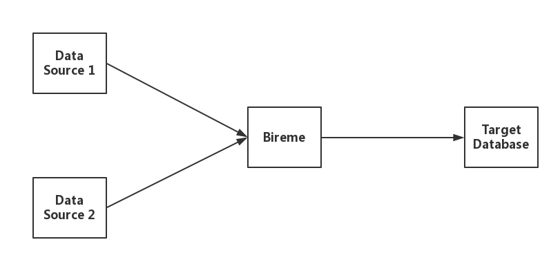

# dbsync

[中文文档](README_zh-cn.md)

[Getting Started Guide](docs/dbsync_guide.md)

Dbsync is an incremental synchronization tool for the Greenplum / HashData data warehouse. Currently supports MySQL data sources.

[Greenplum](http://greenplum.org/) is an advanced, fully functional open source data warehouse that provides powerful and fast analysis of the amount of petabyte data. It is uniquely oriented for large data analysis and is supported by the world's most advanced cost-based query optimizer. It can provide high query performance over large amounts of data.

[HashData](http://www.hashdata.cn) is based on Greenplum to build flexible cloud data warehouses.

Dbsync uses DELETE + COPY to synchronize the modification records of the data source to Greenplum / HashData. This mode is faster and better than INSERT + UPDATE + DELETE.

Features and Constraints:

* Using small batch loading to enhance the performance of data synchronization, the default load delay time of 10 seconds.
* All tables must have primary keys in the target database
* Currently supports Maxwell data sources.

## 1.1 System Architecture



Dbsync supports synchronization work of multiple data sources. It can simultaneously read records from multiple data sources in parallel, and load records to the target database.

## 1.2 Maxwell + Kafka Data Source

Maxwell + Kafka is a data source type that dbsync currently supports, the structure as follows:


* [Maxwell](http://maxwells-daemon.io/) is an application that reads MySQL binlogs and writes row updates to Kafka as JSON.
* [Kafka](http://kafka.apache.org/) is a distributed streaming platform. It lets you publish and subscribe to streams of records.

## 1.3 How does dbsyn work

Dbsync reads records from the data source, converts it into an internal format and caches it. When the cached records reaches a certain amount, it is merged into a task, each task contains two collections, *delete*  collection and *insert* collection, and finally updates the records to the target database.


## 1.4 Introduction to configuration files

The configuration files consist of two parts:

* Basic configuration file: The default is **config.properties**, which contains the basic configuration of dbsync.
* Table mapping file: **\<source_name\>.properties**, each data source corresponds to a file, which specify the table to be synchronized and the corresponding table in the target database. \<Source_name\> is specified in the config.properties file.

### 1.4.1 config.properties

**Required parameters**

|Parameters|Description|
|:---:|:---:|
|target.url|Address of the target database. Format:<br>jdbc:postgresql://\<ip\>:\<port\>/\<database\>|
|target.user|The user name used to connect to the target database|
|target.passwd|The password used to connect to the target database|
|data.source|Specify the data source, that is \<source_name\>, with multiple data sources separated by commas, ignoring whitespace|
|\<source_name\>.type|Specifies the type of data source, for example maxwell|

**Note:** The data source name is just a symbol for convinence. It can be modified as needed.

**Parameters for Maxwell data source**

|Parameters|Description|
|:---:|:---:|
|\<source_name\>.kafka.server|Kafka address. Format:<br>\<ip\>:\<port\>|
|\<source_name\>.kafka.topic|Corresponding topic of data source|

**Other parameters**

|Parameters|Description|Default|
|:---:|:---:|:---:|
|bookkeeping.url|The address of state database used to record the synchronization status|The same as target.url|
|bookkeeping.user|The user name used to connect to the state database|The same as target.user|
|bookkeeping.passwd|The password used to connect to the state database|The same as target.passwd|
|bookkeep.interval|Interval between update of state database in milliseconds|1000|
|bookkeep.table_name|table used to record status|bookkeeping|
|metrics.reporter|Dbsync specifies two monitoring modes, consolo or jmx. If you do not need to monitor, you can specify this as none|console|
|metrics.reporter.console.interval|Time interval between metrics output in seconds. It is valic as long as metrics.reporter is console.|10|
|loader.conn_pool.size|Number of connections to target database, less or equal to the number of Change Loaders|10|
|loader.task_queue.size|The length of task queue in each Change Loader|2|
|transform.pool.size|Thread pool size for Transform|10|
|merge.pool.size|Thread pool size for Merge|10|
|merge.interval|Maxmium interval between Merge in milliseconds|10000|
|merge.batch.size|Maxmium number of Row in one Merge|50000|

### 1.4.2 \<source_name\>.properties

In the configuration file for each data source, specify the table which the data source includes, and the corresponding table in the target database.

```
<OriginTable_1> = <MappedTable_1>
<OriginTable_1> = <MappedTable_1>
...
```

## 1.5 Reference

[Maxwell Reference](http://maxwells-daemon.io/)  
[Kafka Reference](http://kafka.apache.org/)