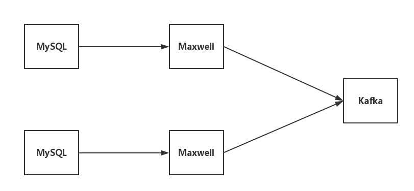
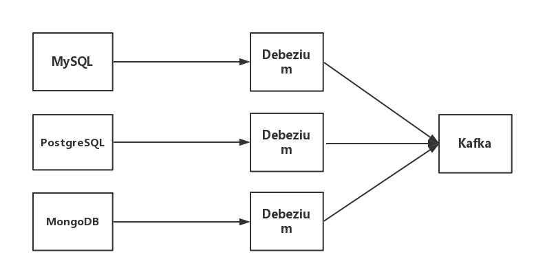
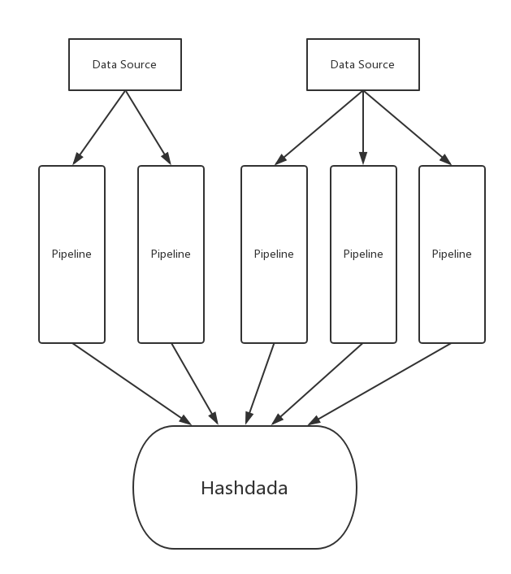

# bireme

[](https://travis-ci.org/HashDataInc/bireme)

[入门指南](docs/bireme_guide_zh-cn.md)

Bireme 是一个 Greenplum / HashData 数据仓库的**增量**同步工具。目前支持 MySQL、PostgreSQL 和 MongoDB 数据源。  

[Greenplum](http://greenplum.org/) 是一个高级，功能齐全的开源数据仓库，为PB级数据量提供强大而快速的分析。它独特地面向大数据分析，由世界上最先进的基于成本的查询优化器提供支持，可在大数据量上提供高分析查询性能。

[HashData](http://www.hashdata.cn) 则是基于 Greenplum 构建弹性的云端数据仓库。  

Bireme 采用 DELETE + COPY 的方式，将数据源的修改记录同步到 Greenplum / HashData ，相较于INSERT + UPDATE + DELETE的方式，COPY 方式速度更快，性能更优。

Bireme 特性与约束：

* 采用小批量加载的方式提升数据同步的性能，默认加载延迟时间为10秒钟。
* 所有表在目标数据库中必须有主键

## 1.1 数据流  


Bireme 支持多数据源同步工作，可以同时从多个数据源并行读取数据，并将数据同步加载到目标数据库。

## 1.2 数据源

### 1.2.1 Maxwell + Kafka

Maxwell + Kafka 是 bireme 目前支持的一种数据源类型，架构如下图：


  
* [Maxwell](http://maxwells-daemon.io/) 是一个 MySQL binlog 的读取工具，它可以实时读取 MySQL 的 binlog，并生成 JSON 格式的消息，作为生产者发送给 Kafka。    

### 1.2.2 Debezium + Kafka

Debeziuk + Kafka 是 bireme 支持的另外一种数据源类型，架构如下图：



* [Debezium](http://debezium.io/) 是一个CDC工具，可以将数据库的增删改转换为事件流，并把这些修改发送给 Kafka

## 1.3 Bireme工作原理

Bireme 从数据源读取数据 (Record)，将其转化为内部格式 (Row) 并缓存，当缓存数据达到一定量，将这些数据合并为一个任务 (Task)，每个任务包含两个集合，delete 集合与insert 集合，最后把这些数据更新到目标数据库。

每个数据源可以有多个 pipeline，对于 maxwell，每个 Kafka partition 对应一个 pipeline；对于 debezium，每个 Kafka topic 对应一个 pipeline。



下图描述了在一个 pipeline 中对 change data 的处理过程。


## 1.4 配置文件介绍

配置文件包括两部分：  

* 基本配置文件：默认为 **config.properties**，包含 bireme 的基本配置。  
* 表映射文件：**\<source_name\>.properties**，每一个数据源都对应一个该类文件，指定待同步的表及该表在目标数据库中对应的表。 \<source_name\> 在 config.properties 文件中指定。

### 1.4.1 config.properties

**必要参数**
  
|参数|描述|
|:---:|:---:|
|target.url|目标数据库的地址，格式:<br>jdbc:postgresql://\<ip\>:\<port\>/\<database\>|
|target.user|用于连接目标数据库的用户名|
|target.passwd|用于连接目标数据库的密码|
|data.source|指定数据源，即 \<source_name\>，多个数据源用逗号分隔开，忽略空白字符|
|\<source_name\>.type|指定数据源的类型，例如 maxwell|

**注:** 数据源名称只是符号，方便在Bireme中指代，可以根据需求修改。

**Maxwell 数据源参数**

|参数|描述|
|:---:|:---:|
|\<source_name\>.kafka.server|数据源的 Kafka 地址，格式:  <br>\<ip\>:\<port\>|
|\<source_name\>.kafka.topic|数据源在 Kafka 中对应的 topic|
|\<source_name\>.kafka.groupid|消费者 group id, 默认值是 *bireme*|

**Debezium 数据源参数**

|参数|描述|
|:---:|:---:|
|\<source_name\>.kafka.server|数据源的 Kafka 地址，格式:  <br>\<ip\>:\<port\>|
|\<source_name\>.kafka.groupid|消费者 group id, 默认值是 *bireme*|
|\<source_name\>.kafka.namespace|数据源 debezium 的名字|


**其它参数**

|参数|描述|默认值|
|:---:|:---:|:---:|
|pipeline.thread_pool.size|Pipeline 线程池的大小|5|
|transform.thread_pool.size|用于 Transform 的线程池大小|10|
|merge.pool.size|用于 Merge 的线程池大小|10|
|merge.interval|最大 Merge 间隔，单位毫秒|10000|
|merge.batch.size|单次 Merge 中最多的 Row 的数量|50000|
|loader.conn_pool.size|目标数据库的连接个数，小于等于 Change Loader 的数量|10|
|loader.task_queue.size|每个 Change Loader 中 Task 队列的长度|2|
|metrics.reporter|Bireme指定了两种监控模式，一种是 console ，另外一种是 jmx ，如果不需要监控，可以指定为 none|console|
|metrics.reporter.console.interval|输出 metrics 的时间间隔，当 metrics.reporter 为 console 有效，单位秒|10|
|state.server.addr|state server 的IP地址|0.0.0.0|
|state.server.port|state server 的端口号|8080|

### 1.4.2 \<source_name\>.properties

数据源的配置文件中，指定该数据源包括的表，以及在目标数据库中对应的表。

```
<OriginTable_1> = <MappedTable_1>
<OriginTable_2> = <MappedTable_2>
...
```

## 1.5 监控

**HTTP 服务器**

Bireme 启动一个轻量级的 HTTP 服务器方便用户获取当前的 Load State.

HTTP 服务器提供了下列端点: 

|端点|描述|
|:---:|:---:|
|/|获取所有数据源的同步状态|
|/\<data source\>|获取指定数据源的同步状态|

返回结果为 JSON 格式。使用参数 *pretty* 可以以用户友好的方式输出结果。

**示例**

下面是一个 Load State 示例:

```
{

  "source_name": "XXX",
  "type": "XXX"
  "pipelines": [
    {
      "name": "XXXXXX",
      "latest": "yyyy-MM-ddTHH:mm:ss.SSSZ",
      "delay": XX.XXX
    },
    {
      "name": "XXXXXX",
      "latest": "yyyy-MM-ddTHH:mm:ss.SSSZ",
      "delay": XX.XXX
    },
  ]
}
```

* *source_name* 是数据源的名称，在配置文件中的指定。
* *type* 是数据源的类型。
* *pipelines* 是包含了一组 pipeline 的同步状态。(每一个数据源可能用多个 pipeline 同时工作。)
 - *name* 是 pipeline 的名称.
 - *latest* 是成功被同步到 hashdata 中，最新的 change data 产生时间。
 - *delay* 是从 change data 进入到成功加载并通知给数据的时间间隔。

## 1.6 参考

[Maxwell 参考](http://maxwells-daemon.io/)  
[Debezium 参考](http://debezium.io/)  
[Kafka 参考](http://kafka.apache.org/)
